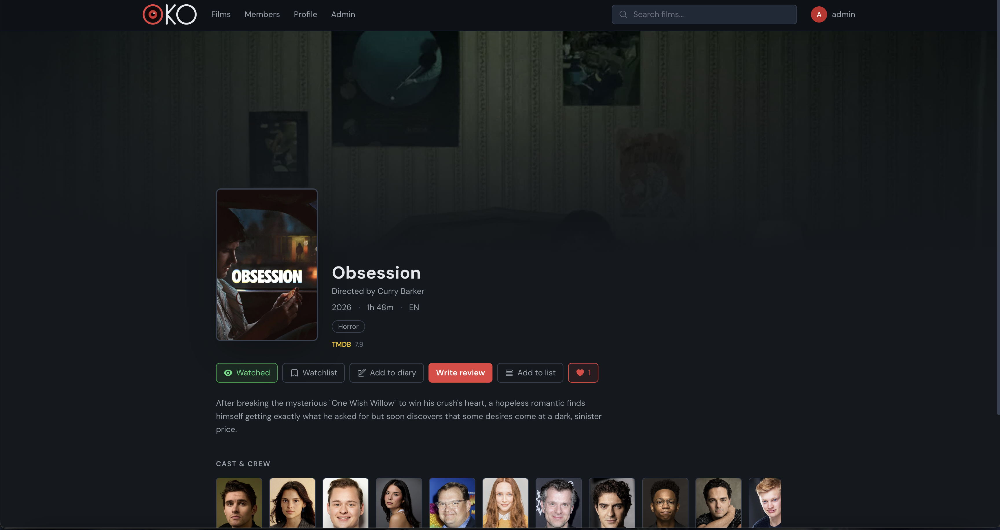
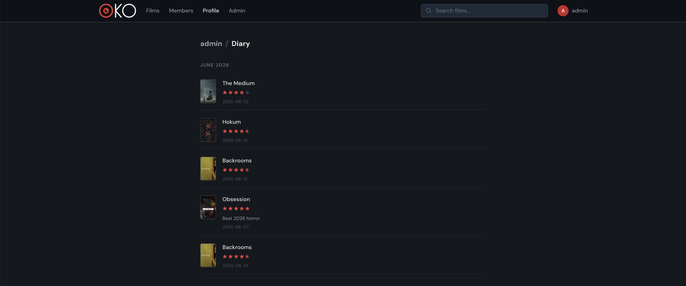

# OKO

A social film tracking web application inspired by [Letterboxd](https://letterboxd.com/). Users can discover movies, log what they've watched, write reviews, keep a diary, build watchlists and lists, and follow other members.

**Live demo:** https://oko-three.vercel.app/


---

## Screenshots

| Home / Discovery | Movie detail | Diary |
|---|---|---|
|  |  |  |

---

## Features

- **Movie discovery** — search TMDB's entire catalogue, browse by genre, year, and language
- **Movie detail pages** — poster, backdrop, cast & crew, TMDB rating, OKO community rating
- **Diary** — log watches with date, rating, and notes; rewatch tracking
- **Reviews** — write and read reviews with spoiler protection and star ratings
- **Watchlist & watched** — track what you've seen and what you want to see
- **Lists** — create curated public or private film lists
- **Social** — follow members, see a personalised activity feed
- **Person pages** — full filmography from TMDB with lazy sync on click
- **Google OAuth2** — sign in with Google or register with email
- **Admin panel** — manage users and movies

---

## Tech Stack

**Backend**
- Java 17, Spring Boot 4
- Spring Security with JWT authentication and Google OAuth2
- Spring Data JPA / Hibernate
- PostgreSQL (production and Docker), H2 (local dev)
- Flyway for database migrations
- TMDB API integration via WebClient

**Frontend**
- React 18
- React Router v6
- Axios
- Tailwind CSS
- Heroicons

**Infrastructure**
- Backend and PostgreSQL deployed on Railway
- Frontend deployed on Vercel
- Docker + Docker Compose for local development
- nginx for serving the React build in Docker

---

## Architecture & Engineering Highlights

The backend was built solo with a focus on clean structure and deliberate design choices:

- **Layered architecture** — a clear separation of `controller` → `service` → `repository`, with DTOs at the API boundary and a dedicated `external/tmdb` layer isolating all third-party calls. Entities never leak out of the service layer.
- **N+1 query elimination** — movie listings originally triggered a query per movie for ratings and like data. The batch mapping path now fetches average ratings, like counts, and per-user liked status in **3 queries total**, regardless of list size.
- **Dynamic filtering with JPA Specifications** — movie filtering uses `JpaSpecificationExecutor` with composable `Specification` predicates, pushing filters into SQL instead of filtering collections in memory.
- **Stateless JWT security** — a custom `JwtAuthenticationFilter` validates tokens on each request; endpoints are secured by role, with public read access to movie and person data and `ROLE_ADMIN` gating the admin API.
- **Centralised error handling** — a single `@RestControllerAdvice` translates domain exceptions (`ResourceNotFoundException`, `DuplicateResourceException`, `UnauthorizedException`) into consistent JSON error responses with logging.
- **Resilient external calls** — every TMDB request runs through `WebClient` with a 5-second timeout and explicit `4xx` / `5xx` handling, so a slow or failing upstream never hangs a request.
- **Environment-aware profiles** — `dev` runs on in-memory H2 with `create-drop`; `prod` and `docker` run on PostgreSQL with **Flyway** managing schema migrations.

---

## Running Locally

### Option 1 — Docker (recommended)

Requires [Docker](https://www.docker.com/products/docker-desktop/) installed.

1. Clone the repository

```bash
git clone https://github.com/Champloo1402/oko.git
cd oko
```

2. Create a `.env` file in the project root

```
TMDB_API_KEY=your_tmdb_api_key
JWT_SECRET=your_jwt_secret
GOOGLE_CLIENT_ID=your_google_client_id
GOOGLE_CLIENT_SECRET=your_google_client_secret
```

> The PostgreSQL connection and `FRONTEND_URL` are configured by `docker-compose.yml`, so the four variables above are all you need to add.

3. Start everything

```bash
docker-compose up --build
```

4. Open `http://localhost:3000`

The Docker setup starts three containers — PostgreSQL, the Spring Boot backend (port `8080`), and the React frontend served by nginx (port `3000`). Data persists between restarts via a Docker volume.

---

### Option 2 — Manual

Requirements: Java 17, Maven, Node.js 20

1. Start the backend

```bash
./mvnw spring-boot:run
```

Runs on `http://localhost:8080` using an H2 in-memory database by default (`dev` profile).

2. Start the frontend

```bash
cd frontend
npm install
npm start
```

Runs on `http://localhost:3000` and proxies API requests to the backend on `8080`.

3. Open `http://localhost:3000`

---

## Environment Variables

| Variable | Description |
|---|---|
| `TMDB_API_KEY` | TMDB API v4 bearer token |
| `JWT_SECRET` | Secret key for signing JWT tokens |
| `GOOGLE_CLIENT_ID` | Google OAuth2 client ID |
| `GOOGLE_CLIENT_SECRET` | Google OAuth2 client secret |

For Railway deployment, these are set in the Railway dashboard along with the PostgreSQL connection variables. For Docker, the four above are read from the `.env` file in the project root; the database connection is supplied by `docker-compose.yml`.

---

## Project Structure

```
oko/
├── src/
│   └── main/
│       ├── java/com/oko/
│       │   ├── config/          # Security, CORS, data initialisation
│       │   ├── controller/      # REST endpoints
│       │   ├── dto/             # Request / response DTOs
│       │   ├── entity/          # JPA entities
│       │   ├── exception/       # Global handler + domain exceptions
│       │   ├── repository/      # Spring Data JPA repositories
│       │   ├── security/        # JWT filter, token provider, OAuth2
│       │   ├── service/         # Business logic
│       │   └── external/tmdb/   # TMDB WebClient + DTOs
│       └── resources/
│           └── db/migration/    # Flyway migrations
├── frontend/
│   ├── src/
│   │   ├── api/
│   │   ├── components/
│   │   ├── context/
│   │   └── pages/
│   ├── Dockerfile.frontend
│   └── nginx.conf
├── Dockerfile.backend
├── docker-compose.yml
└── pom.xml
```

---

## API Highlights

| Method | Endpoint | Description |
|---|---|---|
| `POST` | `/api/auth/register` | Register with email |
| `POST` | `/api/auth/login` | Login, returns JWT |
| `GET` | `/api/movies/search?query=` | Search TMDB |
| `POST` | `/api/movies/sync/{tmdbId}` | Sync movie from TMDB to local DB |
| `GET` | `/api/movies/{id}` | Get movie detail |
| `GET` | `/api/people/{id}/tmdb-filmography` | Full filmography from TMDB |
| `POST` | `/api/reviews` | Create a review |
| `GET` | `/api/feed` | Personalised activity feed |
| `GET` | `/api/users/{username}` | User profile |

---

## About

OKO was designed, built, and deployed solo as a backend-focused diploma project — covering REST API design, authentication, relational data modelling, external API integration, and containerised deployment from scratch.
